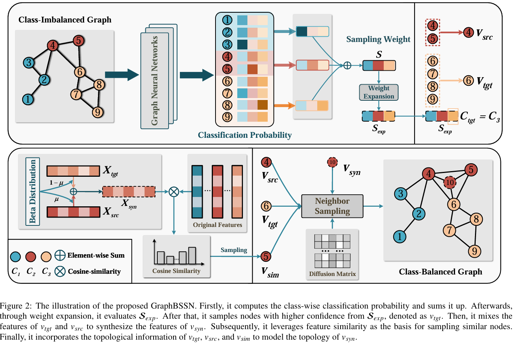

# GraphBSSN: A Simple Yet Effective Generative Method for Node Classification in Class-Imbalanced Graphs

## Requirements
This repository has been tested with the following packages:
+ Python == 3.8.17
+ PyTorch == 2.0.1
+ Pytorch Geometric == 2.3.1
## Important Hyper-parameters
+ `--dataset`: name of the dataset. It could be one of `['Cora', 'CiteSeer', 'PubMed', 'Amazon-Photo', 'Amazon-Computers']`.
+ `--data_path`: the path to the dataset. The dataset will be downloaded to this path automatically when the code is executed for the first time.
+ `--imb_ratio`: imbalance ratio.
+ `--net`: name of the backbone encoder. It could be one of `['GCN', 'GAT', 'SAGE']`.
+ `--alpha`: hyper-parameter controls the proportion of target node.
+ `--beta`: hyper-parameter controls the proportion of similar node.
+ `--yeta`: the expansion rate.
## How to run
For example:
`python main.py --dataset Cora --imb_ratio 100 --net GCN --alpha 1.0 --beta 1.0 --yeta 0.5`
